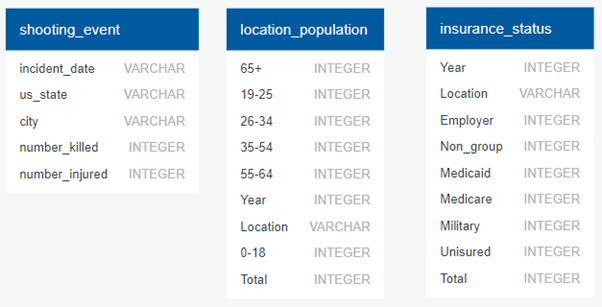
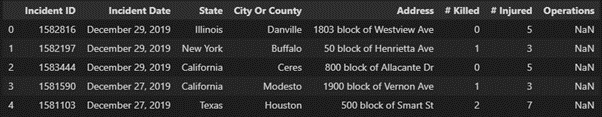
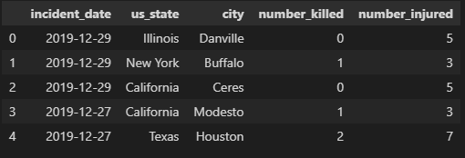
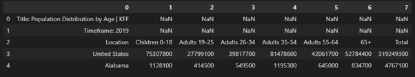
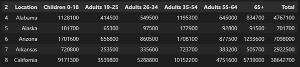
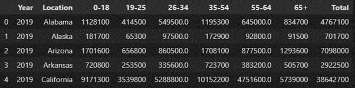
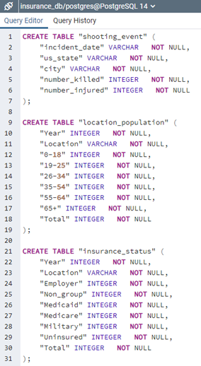
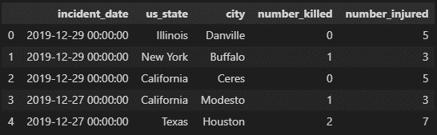

ETL Project
By Karin Ferrada

Project Purpose:
To identify increasing or emerging markets for targeted insurance policies against gun related deaths and injury

Who is the customer?
Insurance company ABC

Why do they want this data?
Insurance company seeking to increase sales in geographical locations that previously had low sales in products relating to gun related deaths and injury. i.e. life insurance, rehabilitation services, death and disability. This will be achieved by targeted marketing campaigns to specific age cohorts and geographical locations with low insurance uptake.  

How is the data to be displayed?
Postgres database
Table 1 = Event of shooting and location
Table 2 = Age demographic of location
Table 3 = Existing Insurance status of location

Data:
https://www.gunviolencearchive.org/
https://www.kff.org/state-category/demographics-and-the-economy/population/

 
Extraction:
Our datasets were sourced as CSV files from public platforms including Gun Violence Archive and Kaiser Family Foundation (KFF). All data was based on location of US State ranging over a period of 3 years from 2017 to2019 as this was the most recent data that could be found for the same period. The sources for our dataset are as follows:
1.	Mass Shooting from Gun Violence Archive
2.	Population Distribution by Age from KFF
3.	Health Insurance Coverage of the Total Population from KFF

Transformation:
Prior to beginning the transformation, the datasets were reviewed to confirm which variables (columns) were relevant and required. This resulted in the following three tables with the following variables being created in a new database named insurance_db via Postgres-PgAdmin:

Mass Shooting-
The Mass shooting dataset was obtained via three separate CSV files for each year and saved in a Resources folder. All three reports held an individual date each (row) incident of mass shooting that occurred. This allowed all three reports to be combined into one dataframe resulting in the below:
 

The existing dataframe was updated and removed the unrequired columns of “Incident ID”, “Address” and “Operations“ via the copy function. 

To further simplify the headings the existing “City or County” was renamed to “City”, # was renamed to number.
The incident date was also formatted to ensure it would be displayed as a date time data type which resulted in the below final output:
 

Population Distribution by Age-
The population distribution dataset was obtained via three separate CSV files for each year and saved in a Resources folder. Unlike the Mass shooting dataset these CSV files did not have a date for each (row) of what year the data is relating to. As a result each CSV file had to be cleaned and transformed separately to include the year before being combined onto the one dataframe.
When the data was read in, it had unrequired rows in row 0,1 3. See below:

 
The 3 rows not required were removed utilising the ILOC function resulting in the below:

 
As mentioned above a new column for Year was required to ensure the correct dataset is being represented for each of the 3 files.
The columns were renamed and reordered.
Once each yearly CSV file completed the above, each yearly dataframe was combined into one dataframe and all the columns data types were converted to numeric with the exception of Location which remained as an object resulting in the below final output:

 
Health Insurance Status-
The health insurance dataset like the Population distribution by Age above was obtained from the same data platform in KFF.  Thus the exact same steps were taken to clean/transform the dataset. The only differences between the two were the naming and reordering of the headers

Load:
The final step was to transfer our final output into a Database. As mentioned above in the Transformation step Postgres was utilised to create a new database. The following schema was applied to create the tables required in the database.

 
The final outputs of each dataframe were specifically matched the columns in the table created in the database. SQLalchemy was then utilised to connect to Postgres and load to the database. A further query was run for each dataframe to ensure the database contained the outputs. See below example for upload of Mass Shooting dataset:

